<picture>
  <source media="(prefers-color-scheme: dark)" srcset="./dark.svg">
  <source media="(prefers-color-scheme: light)" srcset="./light.svg">
  
</picture>

## About me

I'm a Senior Full-Stack .NET Developer with a backend focus. I build and support applications using C#, ASP.NET Core, REST APIs, SQL Server, Azure, and modern JavaScript frameworks. My work spans API and database development, production troubleshooting, application modernization, and user-facing features.

I also build practical AI projects. In AI File Organizer, I integrated a local LLM through Ollama to suggest file destinations while keeping the user in control of every move. In AI Creative Studio, I put a pretrained image-generation model behind a Gradio interface in Google Colab. These projects have taught me to think about model choice, privacy, user review, and the difference between an impressive demo and a dependable workflow.

I'm interested in the next step for AI applications: connecting LLMs to useful tools and data through the Model Context Protocol (MCP). I am exploring MCP-based integrations; the public projects below demonstrate my current hands-on AI work, not a production MCP system.

## Selected work

| Project | What it does | Explore |
| --- | --- | --- |
| **AI File Organizer** | Privacy-first macOS desktop app that suggests file destinations with local Ollama, then waits for review before moving anything. Includes duplicate detection, Undo, and SQLite history. | [Repository](https://github.com/NikhilChowdaryBonthu/AIFileOrganizer) · [Apple Silicon release](https://github.com/NikhilChowdaryBonthu/AIFileOrganizer/releases/tag/v2.1.1) |
| **PawMatch** | Dog-discovery portfolio MVP with four sample listings, filters, an illustrative size-and-energy score, favorites, and interest notes backed by Supabase. Scores are not personalized; notes are not sent to shelters. | [Repository](https://github.com/NikhilChowdaryBonthu/PawMatch) · [Live demo](https://nikhilchowdarybonthu.github.io/PawMatch/) |
| **AI Creative Studio** | Text-to-image workflow using pretrained Stable Diffusion v1.5 through a Colab GPU notebook and Gradio interface. Includes a verified demo recording; it is not a permanently hosted app, and no model was trained. | [Repository](https://github.com/NikhilChowdaryBonthu/Ai-Creative-Studio) · [Run in Colab](https://colab.research.google.com/github/NikhilChowdaryBonthu/Ai-Creative-Studio/blob/main/stable_diffusion_studio.ipynb) · [Watch demo](https://github.com/NikhilChowdaryBonthu/Ai-Creative-Studio#short-demo-video) |

## Toolkit

| Area | Technologies |
| --- | --- |
| Backend | C#, .NET, ASP.NET Core, REST APIs, Entity Framework |
| Frontend | JavaScript, TypeScript, React, Angular, HTML, CSS |
| Data & delivery | SQL Server, PostgreSQL, SQLite, Azure, GitHub Actions, CI/CD |
| AI & LLM workflows | Ollama, local LLM inference, prompt-to-action workflows with human review |
| Generative AI tools | PyTorch, Hugging Face Diffusers, Stable Diffusion v1.5, Gradio, Google Colab |
| Exploring | Model Context Protocol (MCP) and tool-connected LLM applications |

## Connect

[Email me](mailto:nikhilbonthu2@gmail.com) if you'd like to discuss full-stack engineering or one of these projects.
